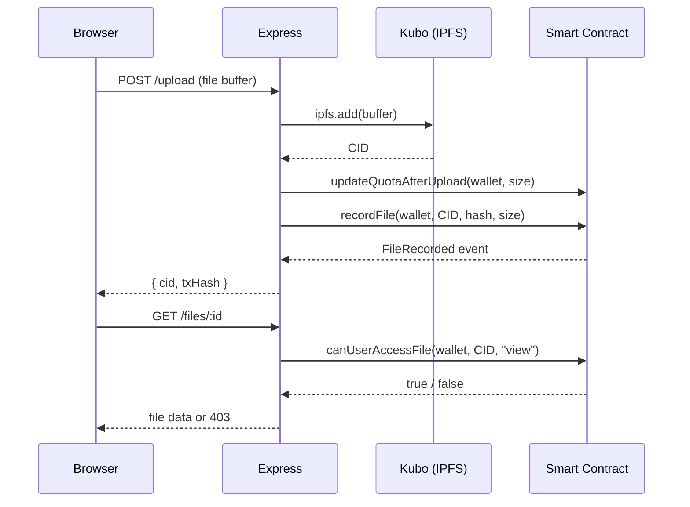

Blockchain Drive stores file content on IPFS and stores permissions and quota state on an Ethereum smart contract. These two systems complement each other: IPFS gives you immutable, content-addressed storage where the same bytes always produce the same identifier, and Ethereum gives you a tamper-proof ledger where every permission grant and quota change is permanently recorded. The Express backend sits between them, coordinating uploads, enforcing access rules, and deciding how strictly each layer is enforced based on your environment configuration.

## IPFS: content-addressed file storage

When you upload a file, the backend sends the raw buffer to the Kubo daemon via its HTTP API. Kubo computes a content identifier (CID) — a cryptographic hash of the file's bytes — and pins the file to the local node. The CID is stored in the database as `ipfs_hash` and is also passed to the smart contract as the `fileId`. Because the CID is derived from content, the same file always produces the same CID, and any modification produces a different one.

```javascript services/ipfsService.js
import { create as createIpfsClient } from "ipfs-http-client";

const ipfs = createIpfsClient({
  url: process.env.IPFS_API_URL || "http://127.0.0.1:5002/api/v0"
});

export async function uploadToIPFS(buffer) {
  const { cid } = await ipfs.add(buffer);
  return cid.toString();
}
```

The IPFS gateway serves files by CID for viewing and downloading. Set `IPFS_GATEWAY_URL` to the address of your gateway (for example `http://127.0.0.1:5002`). The backend constructs gateway URLs in the form `IPFS_GATEWAY_URL/ipfs/<cid>`.

<Note>
  If the Kubo daemon is not running, uploads will fail with an `IPFS_UNAVAILABLE` error. Start the daemon with `ipfs daemon` and verify `IPFS_API_URL` matches the API port shown in `ipfs config show`.
</Note>

## Ethereum: on-chain permissions and quota

The `BlockchainDriveUnified` smart contract is the authoritative source of truth for two concerns:

- **Storage quota** — how many bytes each wallet address is allowed to use, how much has been consumed, and whether an upload should be permitted.
- **File permissions** — who can access which file and with what role (`viewer` or `editor`).

Every significant action emits a Solidity event that is permanently recorded on-chain: `FileRecorded` when a file is uploaded, `FileShared` when access is granted, `AccessRevoked` when access is removed, `QuotaUpdated` after each upload, and `QuotaRefunded` after a deletion. These events form an immutable audit trail.

## Hybrid permission model

The backend uses a hybrid approach that combines on-chain contract checks with database RBAC. When a user requests access to a file, the permission service first calls `canUserAccessFile` on the contract. If the contract returns `true`, access is granted. If the contract returns `false` or is unreachable, the behavior depends on `ENFORCE_CONTRACT_PERMISSIONS`.

```javascript services/permissionService.js
export async function canUserAccessFileHybrid(userId, fileId, action) {
  const enforceContract = process.env.ENFORCE_CONTRACT_PERMISSIONS === "true";

  const walletAddress = await getWalletAddress(userId);
  const cid = file.ipfs_hash;

  try {
    const allowedOnChain = await blockchainService.checkPermission(
      walletAddress, cid, contractAction
    );
    if (allowedOnChain) return true;
    if (enforceContract) return false;
    return await canUserAccessFileDb(userId, fileId, action);
  } catch (err) {
    if (enforceContract) return false;
    return await canUserAccessFileDb(userId, fileId, action);
  }
}
```

Three environment variables control how strictly the contract is enforced:

| Variable | Effect when `true` |
|---|---|
| `ENFORCE_QUOTA_ON_UPLOAD` | Blocks the upload when the on-chain quota check fails |
| `ENFORCE_CONTRACT_PERMISSIONS` | Denies access when the contract check fails; no fallback to DB RBAC |
| `ENFORCE_CONTRACT_SHARING` | Writes the DB share record only if the contract `shareFile` call succeeds |

All three default to `false` so the app works in prototype mode without a live contract.

## Mock vs. real contract mode

Set `USE_REAL_CONTRACTS=true` to connect to a real Ethereum network. When this variable is `false` (the default), the `BlockchainService` operates in mock mode: quota checks always return success, permission checks always return `true`, and share/revoke calls are no-ops. The system still sends lightweight transactions to a local Hardhat node to simulate block formation, so the development experience mirrors production without requiring a deployed contract.

```javascript services/blockchain.js
this.isMocked = process.env.USE_REAL_CONTRACTS !== "true";
```

You can inspect the current mode at any time by calling `GET /blockchain/status`. The response includes all six relevant environment variable values.

<Warning>
  In mock mode, the `GET /blockchain/quota` endpoint returns `mode: "mock"` and all quota fields as `null`. No on-chain quota is checked or enforced. Switch to `USE_REAL_CONTRACTS=true` with a deployed contract to see real quota data.
</Warning>

## How the layers interact



<CardGroup cols={2}>
  <Card title="Smart contracts" icon="file-contract" href="/blockchain/smart-contracts">
    Function signatures, structs, events, and deployment instructions for `BlockchainDriveUnified`.
  </Card>
  <Card title="Quota management" icon="database" href="/blockchain/quota-management">
    How storage quota is allocated, tracked on-chain, and enforced during uploads.
  </Card>
</CardGroup>
